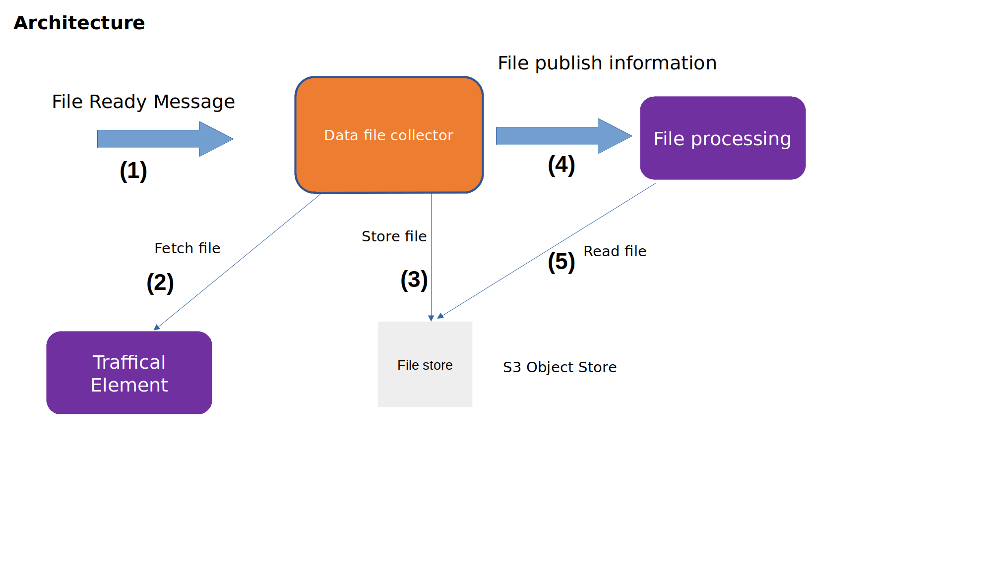

.. This work is licensed under a Creative Commons Attribution 4.0 International License.
.. SPDX-License-Identifier: CC-BY-4.0
.. Copyright (C) 2023 Nordix

Data File Collector
~~~~~~~~~~~~~~~~~~~

************
Introduction
************

The task of the Data File Collector is to collect OAM data files from RAN traffic-handling nodes.
The main use case is (see also the picture below)):

* (1) The DFC receives a "File Ready" VES event from a Kafka topic. This contains a list of all available files.
* (2) The DFC fetches files that are not already fetched from the relevant RAN traffic-handling nodes. This is done using one of the supported file transfer protocols.
* (3) Each file is stored in an S3 Object Store bucket or in the file system (in a persistent volume).
* (4) For each stored file, a "File Publish" message is sent to a Kafka topic for further processing.
* (5) The "File Publish" message can be subscribed by other components, which can then read the fetched file and process it further.

Supported file transfer protocols are:

* SFTP
* FTPES
* HTTP
* HTTPS

The service is implemented in Java Spring Boot.

This product is a part of :doc:`NONRTRIC <nonrtric:index>`.

**************************
Input File Ready VES Event
**************************

Here follows an example of the expected input object:

.. code-block:: javascript

  {
   "event":{
      "commonEventHeader":{
         "sequence":0,
         "eventName":"Noti_RnNode-Ericsson_FileReady",
         "sourceName":"5GRAN_DU",
         "lastEpochMicrosec":151983,
         "startEpochMicrosec":15198378,
         "timeZoneOffset":"UTC+05:00",
         "changeIdentifier":"PM_MEAS_FILES"
      },
      "notificationFields":{
         "notificationFieldsVersion":"notificationFieldsVersion",
         "changeType":"FileReady",
         "changeIdentifier":"PM_MEAS_FILES",
         "arrayOfNamedHashMap":[
            {
               "name":"A20220418.1900-1915_seliitdus00487.xml",
               "hashMap":{
                  "fileFormatType":"org.3GPP.32.435#measCollec",
                  "location":"https://gnb1.myran.org/pmfiles/",
                  "fileFormatVersion":"V10",
                  "compression":"gzip"
               }
            }
         ]
      }
   }
 }

***************************
Output File Publish Message
***************************

Below follows an example of an output File Publish Message.

.. code-block:: javascript

   {
     "productName":"RnNode",
     "vendorName":"Ericsson",
     "lastEpochMicrosec":151983,
     "sourceName":"5GRAN_DU",
     "startEpochMicrosec":15198378,
     "timeZoneOffset":"UTC+05:00",
     "compression":"gzip",
     "fileFormatType":"org.3GPP.32.435#measCollec",
     "fileFormatVersion":"V10",
     "name":"5GRAN_DU/A20220418.1900-1915_seliitdus00487.xml",
     "changeIdentifier":"PM_MEAS_FILES",
     "objectStoreBucket":"ropfiles"
  }

*************
Configuration
*************

The DFC is configured via its application.yaml

An example application.yaml configuration file: ":download:`link <../config/application.yaml>`"

