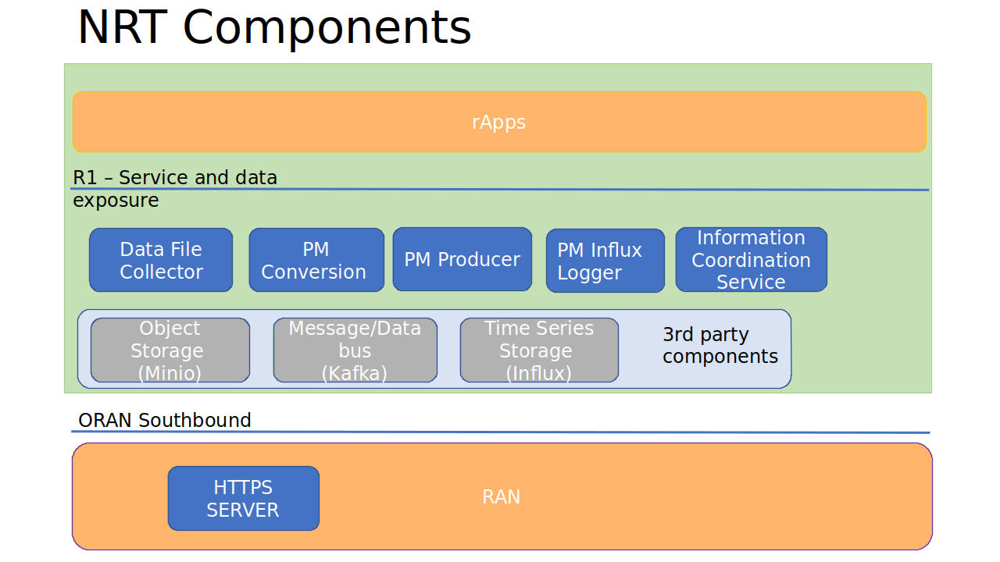
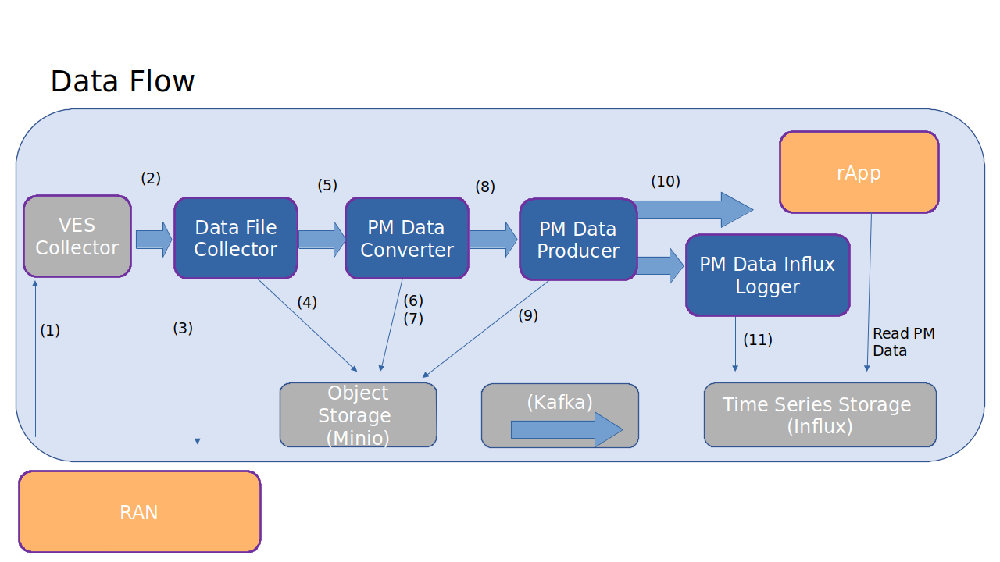
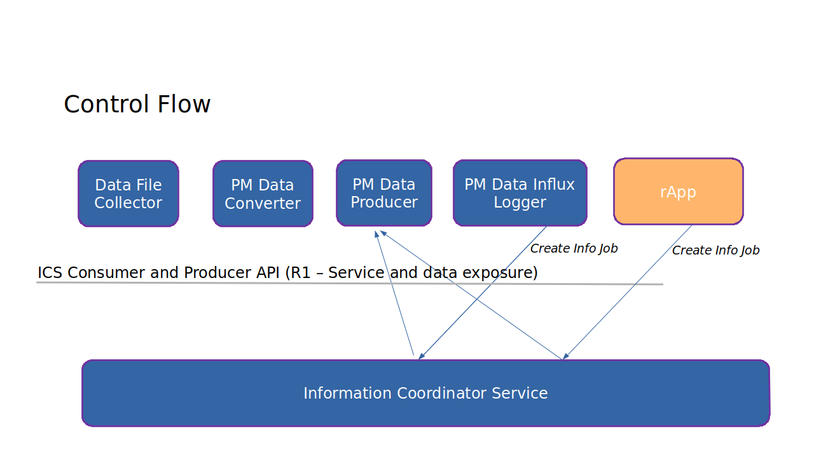

.. This work is licensed under a Creative Commons Attribution 4.0 International License.
.. SPDX-License-Identifier: CC-BY-4.0
.. Copyright (C) 2023 Nordix

Non-RT RIC RAN PM Measurement
~~~~~~~~~~~~~~~~~~~~~~~~~~~~~

Parent repository for components implementing Non-RT RIC RAN PM Use-cases.

********
Overview
********

The OSC Non-RT RIC provides a high performing, fully scalable end-to-end solution for handling
PM Measurements. A PM report (containing aggregated PM measurements over a time interval) is
an XML file. The format is defined by 3GPP (TS 32.432 and 3GPP TS 32.435).
The files are collected from the RAN and stored. An rApp can subscribe for chosen measurement types from
measured resources in the network.

**********
Components
**********

The picture illustrates the components involved.

* The PM Data File Collector fetches the XML files from the RAN.
* The PM File Converter converts these to a Json format. The structure and the contents
  is the same as the XML format.
* The PM Producer handles filtering and distribution of PM data to subscribers. These subscribers can be rApps.
* The Influx Logger stores selected PM measurements into a time series database.
* HTTPS-SERVER is for testing and implements functionality to simulate file transfer from RAN nodes.

The third party products used are:

* Minio object storage, for storing of files.
* Kafka for transferring of data (not the full PM reports, though)
* Influx time series database for storing of selected PM measurements over time.

For more detailed documentation of the components:

* :doc:`Non-RT RIC - RAN PM - PM Data File Collector (Documentation site) <datafilecollector:index>`.
* :doc:`Non-RT RIC - RAN PM - PM File Converter (Documentation site) <pm-file-converter:index>`.
* :doc:`Non-RT RIC - RAN PM - PM Producer (Documentation site) <pmproducer:index>`.
* :doc:`Non-RT RIC - RAN PM - Influx Logger (Documentation site) <influxlogger:index>`.
* `Non-RT RIC - Information Coordinator Service (Documentation site) <https://docs.o-ran-sc.org/projects/o-ran-sc-nonrtric-plt-informationcoordinatorservice/en/latest/>`_.
*  HTTPS-SERVER TBD

*********
Data Flow
*********

The figure below gives an overview of the data flow through the components.

1. The RAN node sends a VES event with available PM measurement report files.
2. The VES event is put on a Kafka topic and picked up by the Data File Collector.
3. A PM report file is fetched from the RAN node by a file transfer protocol. Which protocol to use is defined in the VES event.
4. The collected file is stored
5. A File collected object is put on a Kafka topic and is picked up by the PM File Converter.
6. The file data is read from the file store.
7. A PM report in json format is stored (compressed with gzip).
8. A message (a Json object) indicating that a new PM report (in Json format) is available is put on a Kafka topic and is picked up by the PM Data Producer.
9. The PM data producer reads the Json file
10. The subscribed PM data is sent to the PM data consumers (over Kafka). An rApp may be a PM data consumer.
11. The Influx Logger, which is a PM data consumer, stores PM data in an Influx database.

At anytime an rApp can read logged PM data from the Influx database.

********************
PM Data Subscription
********************
PM measurement data is subscribed by creating an Information Job using the Information Coordination Service (ICS).
This a subscription broker and is part of what is called Data Management an Exposure (DME) in O-RAN.
The ICS makes sure that all data producers gets its data subscriptions (jobs).

In the picture below, an rApp and the Influx Logger are consumers of PM data.

The PM Data Influx logger will create a PM data subscription based on a configuration file. An rApp can create
PM data subscription. The PM Data producer will deliver received PM measurements according to the subscriptions.

The PM Data file collector will fetch all PM measurement files. The PM Data Converted will convert all fetched xml files
to json. So these does not use any subscriptions.

**************************************
PM Subscriber design time dependencies
**************************************

An rApp uses the ICS API to create and manage the subscription of PM Measurements.
The API documentation is available in `Non-RT RIC - Information Coordinator Service (Doc site) <https://docs.o-ran-sc.org/projects/o-ran-sc-nonrtric-plt-informationcoordinatorservice/en/latest/>`_.

The schema for the PM Measurement information jobs is defined in :doc:`Non-RT RIC - RAN PM - PM Producer (Documentation <pmproducer:index>`.
This schema defines parameters used in the subscription (info job) and defines which measurements to subscribe for and on which
kafka topic the information shall be delivered to.

An application retrieving logged PM data from the Influx database needs to consider how the data is stored (the schema). That is
defined in :doc:`Non-RT RIC - RAN PM - Influx Logger (Documentation) <influxlogger:index>`.

.. image:: ./DesignTimeDependencies.png
   :width: 500pt
