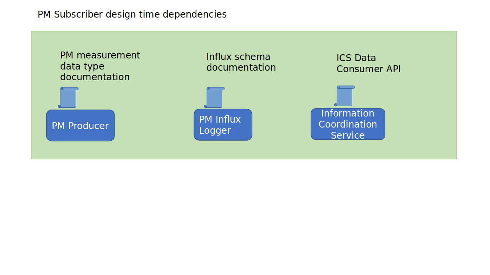

.. This work is licensed under a Creative Commons Attribution 4.0 International License.
.. SPDX-License-Identifier: CC-BY-4.0
.. Copyright (C) 2023 Nordix

Non-RT RIC RAN PM Measurement
~~~~~~~~~~~~~~~~~~~~~~~~~~~~~

Parent repository for components implementing Non-RT RIC RAN PM Use-case.

********
Overview
********

The OSC Non-RT RIC provides a high performaing, fully scalable end-to-end solution for handling of
PM Mesurements. A PM report contains aggregated PM measurements over a time interval is
an XML file defined by 3GPP (TS 32.432 and 3GPP TS 32.435).
The files collected from the RAN and stored. An rApp can subscribe for chosen measurement types from chosen
resources in the network.

**********
Components
**********

The picture illustrates the components involved.

* The PM Data File Collector fetches the XML files from the RAN.
* The PM Data Converter converts these to a Json format. The structure and the contents
  is the same as the XML format.
* The PM Producer handles filtering and distribution of PM data to subscribers. These subscribers can be rApps.
* The Influx Logger stores selected PM mesurements into a time series database.
* HTTPS-SERVER is for testing and implements functionality to simulate file transfer from thye RAN nodes.

The third party products used are:

* Minio object storage, for storing of files.
* Kafka for transferring of data (not the full PM reports, though)
* Influx time series database for storing of selected PM mesurements over time.

For more detailed documentation of the components:

* :doc:`Non-RT RIC - RAN PM - PM Data File Collector (Documentation site) <datafilecollector:index>`.
* PM Data Converter TBD
* :doc:`Non-RT RIC - RAN PM - PM Producer (Documentation site) <pmproducer:index>`.
* :doc:`Non-RT RIC - RAN PM - Influx Logger (Documentation site) <influxlogger:index>`.
* `Non-RT RIC - Information Coordinator Service (Documentation site) <https://docs.o-ran-sc.org/projects/o-ran-sc-nonrtric-plt-informationcoordinatorservice/en/latest/>`_.
* HTTPS-SERVER TBD

*********
Data Flow
*********

The figure below gives am overview of the data flow through the components.

.. image:: ./DataFlow.png
   :width: 900pt

1. The RAN node sends a VES event with available PM measurement report files.
2. The VES event is put on a Kafka topic and picked up by the Data File Collector.
3. A PM report file is fetched from the RAN node by a file transfer protocol. Which protocol to use is defined in the VES event.
4. The collected file is stored
5. A File collected object is put on a Kafka topic and is picked up by the PM Data Converter.
6. The file data is read from the file store.
7. A PM report in json format is stored.
8. An object indicating that a new PM report in Json format is available is put on a Kafka topic and is picked up by the PM Data Producer.
9. The PM data producer reads the Json file
10. The subscribed PM data is sent to the PM data consumers (over Kafka). An rApp may be a PM data consumer.
11. The Influx Logger, which is a PM data consumer, stores PM data in an Influx database.

At anytime an rApp can read logged PM data from the Influx database.

********************
PM Data Subscription
********************
PM measurement data is subscribed by creating an Information Job using the Information Coordination Service (ICS).
This a subscription broker and is part of what is called Data Managament an Exposure (DME) in O-RAN.
The ICS makes sure that all data producers gets its data subscriptions (jobs).

In the picture below, an rApp and the Influx Logger are consumers of PM data.

.. image:: ./ControlFlow.png
   :width: 500pt

**************************************
PM Subscriber design time dependencies
**************************************

An rApp uses the ICS API, which is avaiable in `Non-RT RIC - Information Coordinator Service (Documentation site) <https://docs.o-ran-sc.org/projects/o-ran-sc-nonrtric-plt-informationcoordinatorservice/en/latest/>`_.

The schema for the PM Mesaurement information jobs is defined in :doc:`Non-RT RIC - RAN PM - Influx Logger (Documentation site) <influxlogger:index>`.

An application retrieving logged PM data from the Influx database needs to know how the data is stored. That is
defined in :doc:`Non-RT RIC - RAN PM - Influx Logger (Documentation site) <influxlogger:index>`.

