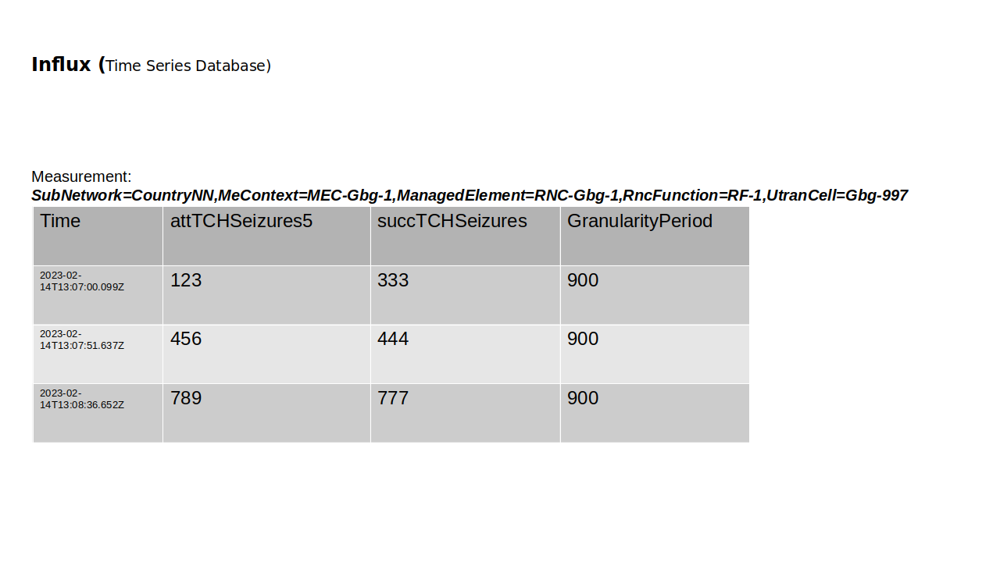

.. This work is licensed under a Creative Commons Attribution 4.0 International License.
.. SPDX-License-Identifier: CC-BY-4.0
.. Copyright (C) 2023 Nordix

Influx Logger
~~~~~~~~~~~~~

************
Introduction
************

The task of the Influx Logger is to receive PM Measurement reports from a Kafka topic and to
store the measurements in an Influx time series database.

.. image:: ./Architecture.png
   :width: 1000pt

This product is a part of :doc:`NONRTRIC <nonrtric:index>`.

***************
Database Schema
***************

The PM Measurements are stored in the influx database. Each measured resource is mapped to a measurement in Influx.
The name of the measurement is the Full Distinguished Name of the resource.
Each measurement type (counter) is mapped to a field. The name of the field is the same as the name of the measurement type.

In addition there is field which stores the GranularityPeriod in seconds of each report.
The GP is for how long time the counters have been aggregated.

The time is the end time of the report. The start time is then the logged time minus the granularity period.

Here follows an example of one Influx table which contains aggregated values for a measured resource.

********************
Input PM Measurement
********************

The PM measurement information received from the Kafka topic is produced by the pm-producer.
Here follows an example of the expected input object:

.. code-block:: javascript

   {
      "event":{
         "commonEventHeader":{
            "domain":"perf3gpp",
            "eventId":"9efa1210-f285-455f-9c6a-3a659b1f1882",
            "eventName":"perf3gpp_gnb-Ericsson_pmMeasResult",
            "sourceName":"O-DU-1122",
            "reportingEntityName":"",
            "startEpochMicrosec":951912000000,
            "lastEpochMicrosec":951912900000,
            "timeZoneOffset":"+00:00"
         },
         "perf3gppFields":{
            "perf3gppFieldsVersion":"1.0",
            "measDataCollection":{
               "granularityPeriod":900,
               "measuredEntityUserName":"RNC Telecomville",
               "measuredEntityDn":"SubNetwork=CountryNN,MeContext=MEC-Gbg-1,ManagedElement=RNC-Gbg-1",
               "measuredEntitySoftwareVersion":"",
               "measInfoList":[
                  {
                     "measInfoId":{
                        "sMeasInfoId":"PM=1,PmGroup=NRCellDU_GNBDU"
                     },
                     "measTypes":{
                        "sMeasTypesList":[
                           "succImmediateAssignProcs"
                        ]
                     },
                     "measValuesList":[
                        {
                           "measObjInstId":"RncFunction=RF-1,UtranCell=Gbg-997",
                           "suspectFlag":"false",
                           "measResults":[
                              {
                                 "p":1,
                                 "sValue":"1113"
                              }
                           ]
                        },
                        {
                           "measObjInstId":"RncFunction=RF-1,UtranCell=Gbg-998",
                           "suspectFlag":"false",
                           "measResults":[
                              {
                                 "p":1,
                                 "sValue":"234"
                              }
                           ]
                        },
                        {
                           "measObjInstId":"RncFunction=RF-1,UtranCell=Gbg-999",
                           "suspectFlag":"true",
                           "measResults":[
                              {
                                 "p":1,
                                 "sValue":"789"
                              }
                           ]
                        }
                     ]
                  }
               ]
            }
         }
      }
   }

*************
Configuration
*************

==========================================
Setting up the PM measurement subscription
==========================================

The influx logger will create its data subscription automatically. This is done by reading a configuration file that
defines the data to log and which Kafka topic to use (1). The contents of this file is used to create
the information job for subscribing of PM measurement (2). ICS will make sure that all PM Measurement producers
are ordered to start producing data (3).

An example jobDefinition.json file: ":download:`link <../config/jobDefinition.json>`"

================
application.yaml
================

The component is configured via its application.yaml

An example application.yaml configuration file: ":download:`link <../config/application.yaml>`"

