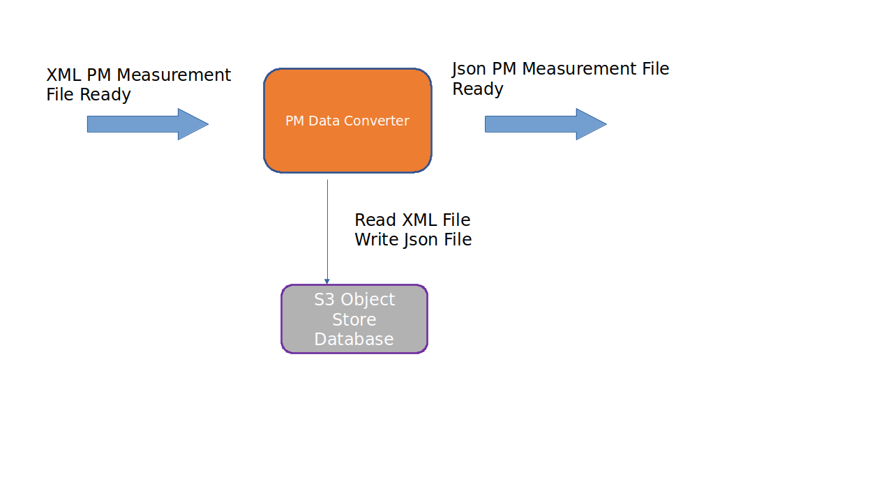

.. This work is licensed under a Creative Commons Attribution 4.0 International License.
.. SPDX-License-Identifier: CC-BY-4.0
.. Copyright (C) 2023 Nordix

PM File Converter
~~~~~~~~~~~~~~~~~

********
Overview
********

The task of the PM File Converter is to convert PM Measurement report files,
(XML formatted according to 3GPP TS 32.432 and 3GPP TS 32.435) into Json.

The component receives objects from kafka that indicates that new PM Report files
are collected from the RAN. The event is sent by the Data File Collector.

The XML file is read from the storage, converted to Json, gzipped and stored.

A Json object indicating that a new Json PM Measurement report is available is sent on
a Kafka topic to be picked up by other components for further processing,

This product is a part of :doc:`NONRTRIC <nonrtric:index>`.

*********************
Output PM Measurement
*********************

The Json format of the PM measurement follows the same structure as the input XML format (defined by 3GPP).

Here follows an example:

.. code-block:: javascript

   {
      "event":{
         "commonEventHeader":{
            "domain":"perf3gpp",
            "eventId":"9efa1210-f285-455f-9c6a-3a659b1f1882",
            "eventName":"perf3gpp_gnb-Ericsson_pmMeasResult",
            "sourceName":"O-DU-1122",
            "reportingEntityName":"",
            "startEpochMicrosec":951912000000,
            "lastEpochMicrosec":951912900000,
            "timeZoneOffset":"+00:00"
         },
         "perf3gppFields":{
            "perf3gppFieldsVersion":"1.0",
            "measDataCollection":{
               "granularityPeriod":900,
               "measuredEntityUserName":"RNC Telecomville",
               "measuredEntityDn":"SubNetwork=CountryNN,MeContext=MEC-Gbg-1,ManagedElement=RNC-Gbg-1",
               "measuredEntitySoftwareVersion":"",
               "measInfoList":[
                  {
                     "measInfoId":{
                        "sMeasInfoId":"PM=1,PmGroup=NRCellDU_GNBDU"
                     },
                     "measTypes":{
                        "sMeasTypesList":[
                           "succImmediateAssignProcs"
                        ]
                     },
                     "measValuesList":[
                        {
                           "measObjInstId":"RncFunction=RF-1,UtranCell=Gbg-997",
                           "suspectFlag":"false",
                           "measResults":[
                              {
                                 "p":1,
                                 "sValue":"1113"
                              }
                           ]
                        },
                        {
                           "measObjInstId":"RncFunction=RF-1,UtranCell=Gbg-998",
                           "suspectFlag":"false",
                           "measResults":[
                              {
                                 "p":1,
                                 "sValue":"234"
                              }
                           ]
                        },
                        {
                           "measObjInstId":"RncFunction=RF-1,UtranCell=Gbg-999",
                           "suspectFlag":"true",
                           "measResults":[
                              {
                                 "p":1,
                                 "sValue":"789"
                              }
                           ]
                        }
                     ]
                  }
               ]
            }
         }
      }
   }

*************************
Output File Ready Message
*************************

Here follows an example of the sent object indicating that a new Json file is available.
It only contains the name of the stored file. The name of the bucket and the minio endpoint
must be known by the event receiver.

.. code-block:: javascript

   {
      "filename": "xyz.json.gzip"
   }

************************
Input File Ready Message
************************

Below follows an example of an input File Ready Message. The
message is sent by the Data File Collector. The only elements used by this component are sourceName, name and
objectStoreBucket.

.. code-block:: javascript

   {
     "productName":"RnNode",
     "vendorName":"Ericsson",
     "lastEpochMicrosec":151983,
     "sourceName":"5GRAN_DU",
     "startEpochMicrosec":15198378,
     "timeZoneOffset":"UTC+05:00",
     "compression":"gzip",
     "fileFormatType":"org.3GPP.32.435#measCollec",
     "fileFormatVersion":"V10",
     "name":"5GRAN_DU/A20220418.1900-1915_seliitdus00487.xml",
     "changeIdentifier":"PM_MEAS_FILES",
     "objectStoreBucket":"ropfiles"
  }

