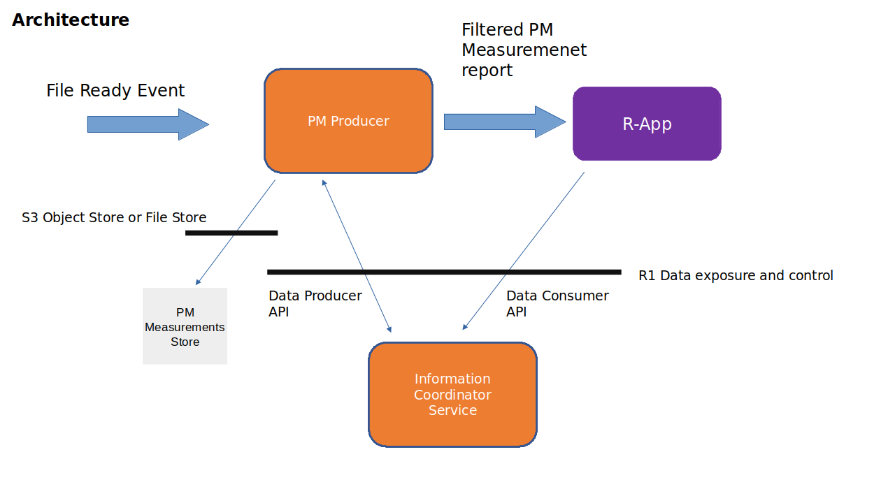
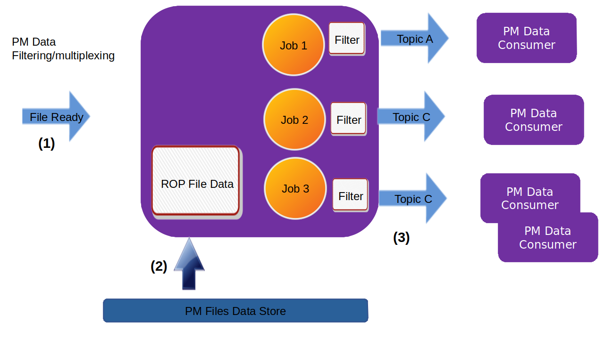
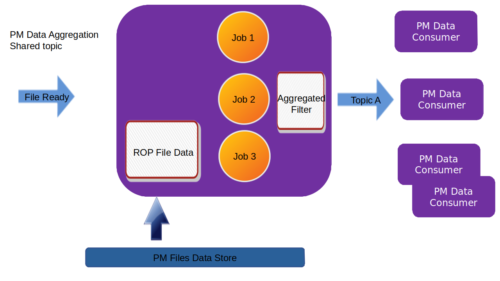

.. This work is licensed under a Creative Commons Attribution 4.0 International License.
.. SPDX-License-Identifier: CC-BY-4.0
.. Copyright (C) 2023 Nordix

Non-RT RIC PM Producer
~~~~~~~~~~~~~~~~~~~~~~

************
Introduction
************

The task of the PM Producer is to process PM reports and to distribute requested information to subscribers.
The main use case is:

* The PM Producer receives a Json object from Kafka which notifies that a new PM report is fetched and is available to processed.

* The actual PM report is in a file, which is stored in an S3 Object store bucket or in the file system (in a mounted volume). The file has the same structure as 3GPP TS 32.432/3GPP TS 32.435, but is converted to json and is extended to contain the information that is encoded the 3GPP measurement report xml file name.

* The PM Producer loads the file and distribute the contents to the subscribers over Kafka according to their subscription parameters. These subscription parameters defines wanted measurement types from given parts of of the network.

The PM Producer registers itself as an information producer of PM measurement data in Information Coordination Service (ICS).

A data consumer can create an information job (data subscription) using the ICS consumer API (for rApps) or the A1-EI (Enrichment Information) API (for NearRT-RICs).
The PM Producer will get notified when information jobs of type 'PM measurements' are created.

The service is implemented in Java Spring Boot.

This product is a part of :doc:`NONRTRIC <nonrtric:index>`.

**************
Delivered data
**************
When a data consumer (e.g an rApp) creates an Information Job, a Kafka Topic is given as output for the job.
After filtering, the data will be delivered to the output topic.

The format of the delivered PM measurement is the same as the input format (which in turn is a Json mapping done from
3GPP TS 32.432/3GPP TS 32.435).
The data can be delivered in gzipped format or in cleartext (indicated by an element in the Kafka header).

The result of the PM filtering preserves the structure of a 3GPP PM report.
Here follows an example of a resulting delivered PM report.

.. code-block:: javascript

   {
      "event":{
         "commonEventHeader":{
            "domain":"perf3gpp",
            "eventId":"9efa1210-f285-455f-9c6a-3a659b1f1882",
            "eventName":"perf3gpp_gnb-Ericsson_pmMeasResult",
            "sourceName":"O-DU-1122",
            "reportingEntityName":"",
            "startEpochMicrosec":951912000000,
            "lastEpochMicrosec":951912900000,
            "timeZoneOffset":"+00:00"
         },
         "perf3gppFields":{
            "perf3gppFieldsVersion":"1.0",
            "measDataCollection":{
               "granularityPeriod":900,
               "measuredEntityUserName":"RNC Telecomville",
               "measuredEntityDn":"SubNetwork=CountryNN,MeContext=MEC-Gbg-1,ManagedElement=RNC-Gbg-1",
               "measuredEntitySoftwareVersion":"",
               "measInfoList":[
                  {
                     "measInfoId":{
                        "sMeasInfoId":"PM=1,PmGroup=NRCellDU_GNBDU"
                     },
                     "measTypes":{
                        "sMeasTypesList":[
                           "succImmediateAssignProcs"
                        ]
                     },
                     "measValuesList":[
                        {
                           "measObjInstId":"RncFunction=RF-1,UtranCell=Gbg-997",
                           "suspectFlag":"false",
                           "measResults":[
                              {
                                 "p":1,
                                 "sValue":"1113"
                              }
                           ]
                        },
                        {
                           "measObjInstId":"RncFunction=RF-1,UtranCell=Gbg-998",
                           "suspectFlag":"false",
                           "measResults":[
                              {
                                 "p":1,
                                 "sValue":"234"
                              }
                           ]
                        },
                        {
                           "measObjInstId":"RncFunction=RF-1,UtranCell=Gbg-999",
                           "suspectFlag":"true",
                           "measResults":[
                              {
                                 "p":1,
                                 "sValue":"789"
                              }
                           ]
                        }
                     ]
                  }
               ]
            }
         }
      }
   }

==================
Sent Kafka headers
==================

For each filtered result sent to a Kafka topic, there will the following properties in the Kafka header:

* type-id, this property is used to indicate the ID of the information type. The value is a string.
* gzip, if this property exists the object is gzip'ed (otherwise not). The property has no value.
* source-name, the name of the source RAN traffic-handling element from which the measurements originate.

*************
Configuration
*************

The component is configured by a configuration file and by the normal spring boot configuration file (application.yaml).

==================
Configuration file
==================

The configuration file defines Kafka topics that should be listened to and registered as information types which can be subscribed to.
There is an example configuration file in config/application_configuration.json

Each entry will be registered as a subscribe information type in ICS. The following attributes can be used in each entry:

* id, the information type identifier.

* kafkaInputTopic, a Kafka topic to listen to for new file events.

* inputJobType, the information type for new file events subscription.

* inputJobDefinition, the parameters for the new file events subscription.

The last two parameters are used to create the subscription for the input to this component (subscription of file ready events).

Below follows an example of a configuration file.

.. code-block:: javascript

 {
   "types": [
      {
         "id": "PmDataOverKafka",
         "kafkaInputTopic": "FileReadyEvent",
         "inputJobType": "xml-file-data-to-filestore",
         "inputJobDefinition": {
            "kafkaOutputTopic": "FileReadyEvent",
            "filestore-output-bucket": "pm-files-json",
            "filterType": "pmdata",
            "filter": {
               "inputCompression": "xml.gz",
               "outputCompression": "none"
            }
         }
      }
   ]
 }

================
application.yaml
================
As any springboot application, this is component configured via an application.yaml file.

An example application.yaml configuration file: ":download:`link <../config/application.yaml>`"

**************************
Information Job Parameters
**************************

The schema for the parameters for PM measurements subscription is defined in file src/main/resources/typeSchemaPmData.json.

=====================
typeSchemaPmData.json
=====================

The type specific json schema for the subscription of PM measurement:

.. code-block:: javascript

   {
   "$schema": "http://json-schema.org/draft-04/schema#",
   "type": "object",
   "additionalProperties": false,
   "properties": {
      "filter": {
         "type": "object",
         "additionalProperties": false,
         "properties": {
            "sourceNames": {
               "type": "array",
               "items": [
                  {
                     "type": "string"
                  }
               ]
            },
            "measObjInstIds": {
               "type": "array",
               "items": [
                  {
                     "type": "string"
                  }
               ]
            },
            "measTypeSpecs": {
               "type": "array",
               "items": [
                  {
                     "type": "object",
                     "properties": {
                        "measuredObjClass": {
                           "type": "string"
                        },
                        "measTypes": {
                           "type": "array",
                           "items": [
                              {
                                 "type": "string"
                              }
                           ]
                        }
                     },
                     "required": [
                        "measuredObjClass"
                     ]
                  }
               ]
            },
            "measuredEntityDns": {
               "type": "array",
               "items": [
                  {
                     "type": "string"
                  }
               ]
            },
            "pmRopStartTime": {
               "type": "string"
            },
            "pmRopEndTime": {
               "type": "string"
            }
         }
      },
      "deliveryInfo": {
         "type": "object",
         "additionalProperties": false,
         "properties": {
            "topic": {
               "type": "string"
            },
            "bootStrapServers": {
               "type": "string"
            }
         },
         "required": [
            "topic"
         ]
      }
   },
   "required": [
      "filter", "deliveryInfo"
   ]
   }

The following properties are defined:

* filter, the value of the filter expression. This selects which data to subscribe for. All fields are optional and excluding a field means that everything is selected.

   * sourceNames, section of the names of the reporting RAN traffic-handling nodes
   * measObjInstIds, selection of the measured resources. This is the Relative Distinguished Name (RDN) of the MO that
     has the counter.
     If a given value is contained in the filter definition, it will match (partial matching).
     For instance a value like "NRCellCU" will match "ManagedElement=seliitdus00487,GNBCUCPFunction=1,NRCellCU=32".
   * measTypeSpecs, selection of measurement types (counters). This consists of:

      * measuredObjClass, the name of the class of the measured resources.
      * measTypes, the name of the measurement type (counter). The measurement type name is only
        unique in the scope of an MO class (measured resource).

   * measuredEntityDns, selection of DNs for the RAN traffic-handling elements.

   * pmRopStartTime, if this parameter is specified already collected PM measurements files will be scanned to retrieve historical data.
     This is the time from when the information shall be returned.
     In this case, the query is only done for files from the given "sourceNames".
     If this parameter is excluded, only "new" reports will be delivered as they are collected from the RAN traffic-handling nodes.
     How old information that can be retrieved depends on the retention time for the storage (if minio it used, it is a S3 bucket).
     A best effort is done, so that the stored files that are in time range are scanned even if the
     specified time is too long back in time.

   * pmRopEndTime, for querying already collected PM measurements. Only relevant if pmRopStartTime.
     If this parameters is given, no reports will be sent as new files are collected.

* deliveryInfo, defines where the subscribed PM measurements shall be sent.

  * topic, the name of the kafka topic
  * bootStrapServers, reference to the kafka bus to used. This is optional, if this is omitted the default configured kafka bus is used (which is configured in the application.yaml file).

Below follows examples of some filters.

.. code-block:: javascript

    {
      "filter":{
        "sourceNames":[
           "O-DU-1122"
        ],
        "measObjInstIds":[
           "UtranCell=Gbg-997"
        ],
        "measTypeSpecs":[
           {
              "measuredObjClass":"UtranCell",
              "measTypes":[
                 "succImmediateAssignProcs"
              ]
            {
        ]
      }
   }

Here follows an example of a filter that will
match two counters from all cells in two RAN traffic-handling nodes.

.. code-block:: javascript

    {
      "filterType":"pmdata",
      "filter": {
        "sourceNames":[
           "O-DU-1122", "O-DU-1123"
        ],
        "measTypeSpecs":[
             {
                "measuredObjClass":"NRCellCU",
                "measTypes":[
                   "pmCounterNumber0", "pmCounterNumber1"
                ]
             }
          ],

      }
    }

****************************
PM measurements subscription
****************************

The sequence is that a "new file event" is received (from a Kafka topic).
The file is read from local storage (file storage or S3 object store). For each Job, the specified PM filter is applied to the data
and the result is sent to the Kafka topic specified by the Job (by the data consumer).

=========================================
Several Jobs sharing the same Kafka topic
=========================================

If several jobs publish to the same Kafka topic (shared topic), the resulting filtered output will be an aggregate of all matching filters.
So, each consumer will then get more data than requested.

